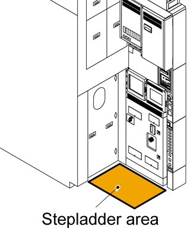
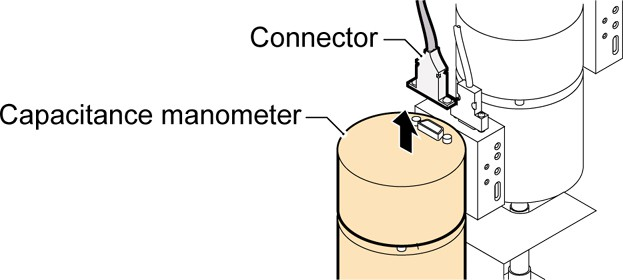
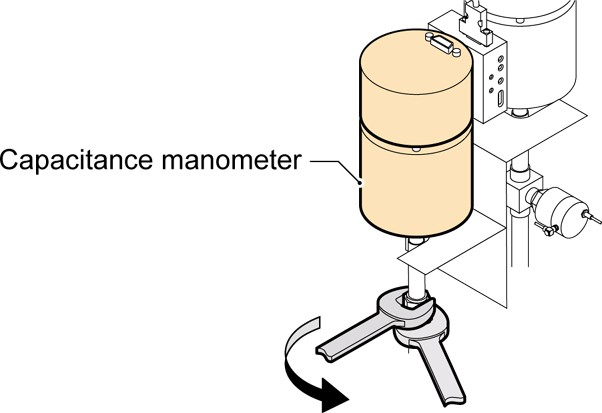
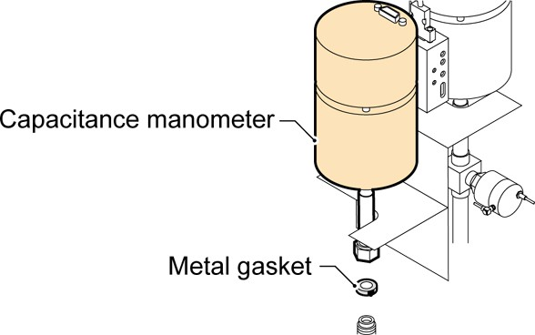
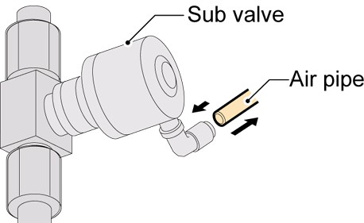
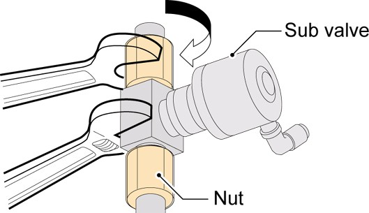
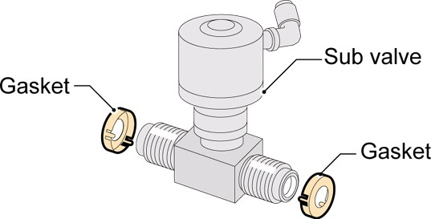

### 커패시턴스 마노미터 제거
1. 유지보수 구역에 스텝래더를 배치하여 정전 용량 측정기를 제거합니다.

참고:　스텝래더에서 넘어져 뼈가 부러지거나 다른 부상을 입지 않으려면 스텝래더에서 작업할 때 항상 안전 하네스를 사용하세요.

2. 정전 용량 측정기 커넥터를 제거합니다.

3. 정전 용량 압력계를 제거하려면:
3.1 진공 파이프 너트를 렌치로 고정하고 두 번째 렌치를 사용하여 커패시턴스 압력계 너트를 풉니다.
3.2 너트를 제거하고 진공 파이프에서 정전 용량계를 제거합니다.
3.3 진공 파이프 연결부에서 금속 개스킷을 제거합니다.

서브 밸브 제거
4. 서브 밸브에 연결된 공기 파이프를 제거합니다.

5. 진공 파이프에서 서브 밸브를 제거하려면:

5.1 렌치로 서브 밸브 본체를 고정하고 두 번째 렌치를 사용하여 진공 파이프 너트를 풉니다.
5.2 너트를 제거하고 진공 파이프에서 서브 밸브를 제거합니다.

5.3 서브 밸브의 나사산에서 금속 가스켓을 제거합니다.