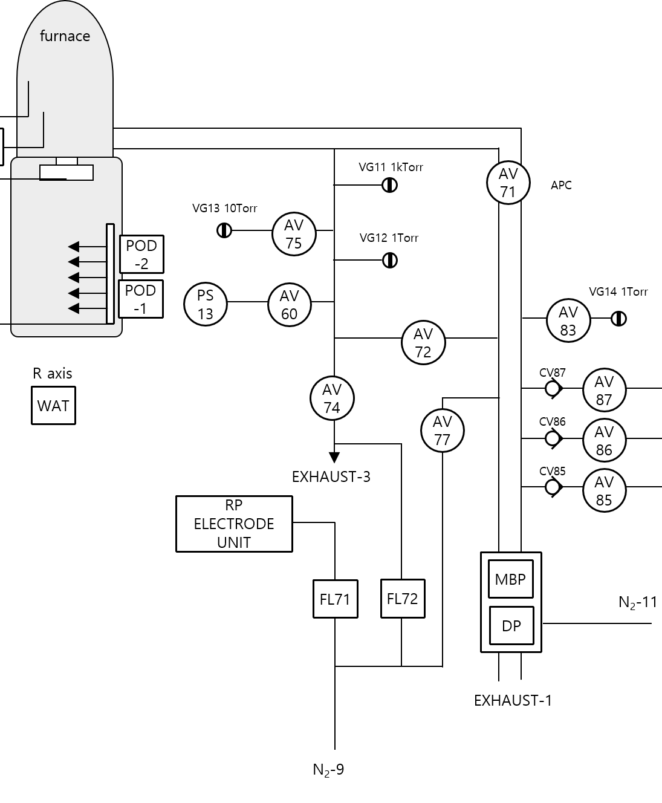

### VG12 Gauge 상태 확인 
#### ①  Base 압력 변화 확인(Leak 점검)
ⓐ  공급되는 가스가 차단된 상태에서 PUMPING 진행시의 최저 압력을 확인한다. 이를 Base압력으로 확인한다. Base압력이 10mTorr이상인 경우는 추가 N2 퍼지 및 안정화를 가진다. 
ⓑ  충분히 N2 퍼지가 된 상태에서 AV71(APC)를 닫으면서 VG12, VG13의 값이 얼마나 변하는지를 점검한다.
ⓒ  VG12와 VG13의 변화가 동일하면서 LEAK 수치가 3mTorr/5min이내인 경우 문제가 없는 것으로 판단한다.
ⓓ  VG12와 VG13의 압력 변화 편차가 큰 경우 VG12의 압력을 확인하고 편차가 너무 크면 VG12 Gauge를 교체 해야 한다.
#### ②  가스 유량 대비 Gauge압력값을 비교 점검
ⓐ  펌핑을 진행하여 튜브 내부를 고진공상태로 만든다.(VG13 <10mTorr)
ⓑ  가스 라인과 튜브 내부를 N2 가스로 퍼지를 진행한다. 
ⓒ  다시 고진공 펌핑의 상태에서 Gauge압력을 확인한다. (VG12, VG13의 비교)
ⓓ  N2 MFC를 이용해서 특정 유량을 흘리고 VG12, VG13을 비교 한다.
ⓔ  VG12, VG13의 변화를 확인하고 셋업 시와 대비하여 많은 차이를 보이는 경우 Gauge교체 등의 절차를 따른다.
