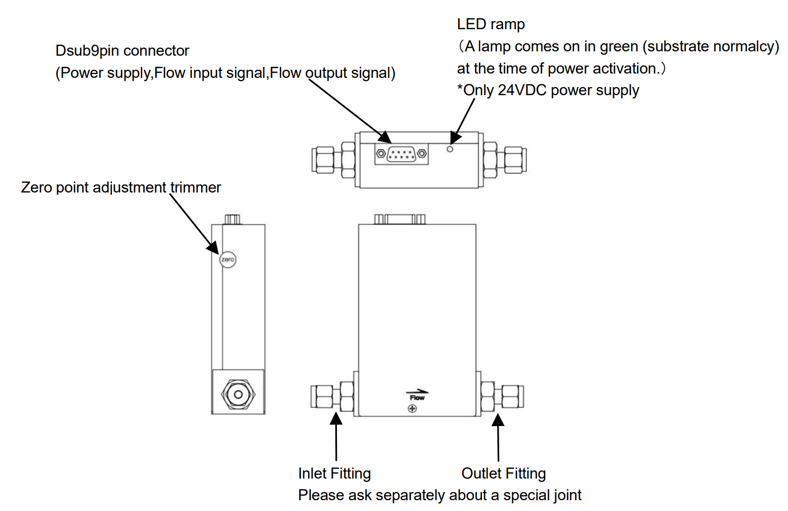
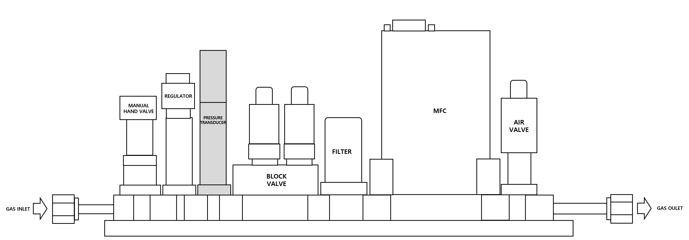

### MFC 점검
#### ① MFC Zero Point 점검

  1. Tube내부를 펌핑하여 고진공 상태로 만든다. (VG13 < 1Torr)
  2. Gas Line의 내부를 N2 Gas로 퍼지를 진행한다. 
  3. 만약 MFC 전원을 다시 연결한 경우 5분이상(30분 권장) 가스의 흐름 없이 그대로 두십시오. 웜업을 하지 않을 시 유량 정확도가 저하된다.
  4. 영점 보정 이전에 가스 흐름이 차단된 상태에서의 유량을 확인한다. 가스 흐름이 정지된 상태에서 1SLM 이상의 값이 나타나면 Zero Cal이 필요한 상태이다.(사용자 조건에 따라 Zero Point를 다르게 가져감.) 그리고 가스를 흘려서 유량상태를 점검 한다.
  5. 영점 보정 기능을 사용할 때, 본체 내부의 압력을 가할 경우 올바른 영점 보정이 수행되지 않는다. 또한, 센서의 안정을 고려하여 가스 공급이 중단한 후 최소 1분 이상 경과한 뒤 영점 보정 기능을 사용하는 것을 권장 한다. 
  6. 영점 조정 버튼을 눌러 준다.
  7. 영점 조정 이후 가스가 차단된 상태에서의 유량과 가스를 흔린 상태에서의 유량을 이전과 비교한다. 
  8. 영점 조정은 가스의 실제 유량에 변화를 줄 수 있으므로 장기간 사용 중에는 권장하지 않으며, 최초 셋업 이후 실시하도록 한다. 
#### ② RF Noise 점검
  1. Tube 내부의 분위기를 RF Plasma가 On될 수 있는 환경으로 만들어 준다.
  2. Tube 내부 진공 상태 확인한다. ( VG13 < 1Torr )
  3. DCS MFC N2 가스를 흘려준다.
  4. RF ON을 하여 DCS MFC 유량이 변화가 있는지를 점검한다.
  5. 유량변화가 생기는 경우 접지 추가 대책, MFC 교체 등의 추가 작업 진행 한다.

### MFC 이외 점검
#### ① 가스 압력 점검

  1. 그림의 가스라인 구성에서 회색 음영 부분이 라인의 압력을 확인하는 PT(Pressure Transducer)센서이며, 압력의 상태를 확인하기 위해서는 먼저 가스가 차단된 상태에서 PT 센서의 값을 확인한다.
  2. N2 가스를 이용하여 가스를 흘릴 때 PT 센서의 압력을 확인하고, 정체시와 흘릴시의 압력상태를 확인한다.
  3. 가스가 정체시에 입력이 비정상적으로 올라간 경우는 REGULATOR의 고장에 의한 현상으로 REGULATOR를 교체 해야한다. 
  4. 가스의 정체 혹은 흘릴때의 상태가 셋업시 기준과 다른 경우는 가스 공급단에서의 변화를 확인한다.
  5. 만약 가스 공급단에서 문제가 없다면, PT 센서를 확인하여 교체 혹은 점검한다.
