조치 방법:
필요 리소스소요시간	: 1시간
필요인원: 1명
필요한 도구:Handy communication terminal
(HCT) Hexagonal wrenches
Wrenches
Phillips screwdriver부품 또는 소모품:New magnetic fluid seal unit
Cleanroom wipes (nonwoven)
Ethanol/deionized (DI) water solution
Cleanroom gloves
Plastic sheet
개인 보호 장비:Safety glassesSafety gloves
전제 조건 기술:
Fab safety training
Basic tool and instrument use
Interlock knowledge and use
Controller software use
Gas training
Mechanical training
Knowledge of operating principles and sequence of operations
유지보수 준비
1. 다음 단계로 진행하기 전에 다음 두 가지 시스템 조건을 확인합니다:
- 실행 중인 레시피가 없습니다.
- 웨이퍼나 캐리어가 전송되지 않습니다.

2. 프로세스 튜브와 배기 라인을 질소로 퍼지합니다.

3. 적재 구역에서 공기를 교환하려면:
3.1 가스 밸브를 수동으로 열고 닫을 수 있도록 가스 흐름도 패널을 설정합니다.
3.2 적재 구역에 있는 질소 공급 라인의 밸브를 닫습니다.
3.3 AIR INV 밸브를 누릅니다.
3.4 적재 구역에서 공기 교환을 시작하려면 EXH DMPR 밸브를 누릅니다.
3.5 산소 농도 검출기를 사용하여 적재 구역의 대기 중 산소 함량이 부피 기준으로 최소 19.5%인지 확인합니다.
3.6 적재 구역에 있는 질소 공급 라인의 핸드 밸브를 닫습니다.

4. 적재 구역에서 대기를 교환한 후 모든 가스의 공급을 끄려면:
4.1 가스 공급 밸브를 닫으려면 가스 흐름도 패널의 스위치를 누릅니다. 열린 밸브는 불이 켜진 스위치로 표시됩니다.
4.2 가스 라인의 모든 핸드 밸브를 닫습니다.
4.3 위험 가스 밸브를 잠그고 태그를 붙입니다.

5. 메인 히터 전원을 끄려면:
5.1 전원을 끌 수 있을 때까지 수동으로 메인 히터 온도를 낮춥니다.
5.2 히터 스위치를 끕니다.

6. 다음 히터가 실온에 있는지 확인합니다:
히터: 메인 히터
확인 절차: WAVES 컨트롤러 온도 상태 화면 또는 EXCORE 미터 릴레이에서 확인합니다.

7. 보트 엘리베이터 캡에 냉각수 공급을 중단합니다. 공급 밸브(IN)를 끄고 폐수 밸브(OUT)를 끄는 것부터 시작합니다.

8. HCT 케이블을 가스 박스에 있는 단자에 연결합니다.

9. HCT를 사용하여 보트 엘리베이터를 튜브 카트 설정 위치로 낮춥니다.

10. 뒷문을 엽니다.

11. 보트와 받침대를 제거합니다.
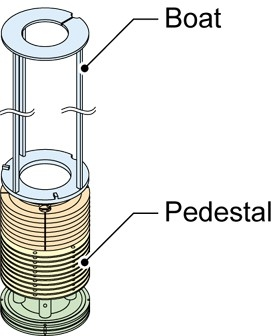

12. 기계적 일시 정지 해제하기:
참고: 문을 열면 자동화를 일시 중지하는 기계식 인터록이 작동합니다. 이 작업을 완료하려면 자동화를 사용해야 하므로 이 작업 중에만 기계식 일시 중지를 해제해야 합니다.
12.1 도어 프레임에 있는 오버라이드 스위치를 꺼냅니다.
12.2 BUZZER RESET을 눌러 알람 버저를 잠급니다.
12.3 WAVES 알람 상세 화면에서 알람을 삭제합니다.
12.4 용광로 뒤쪽에서 TX PAUSE와 ELV PAUSE를 누릅니다.

13. HCT를 사용하여 보트 엘리베이터를 자기 씰 유닛에서 작업하기 쉬운 위치로 이동합니다.

14. 시스템을 완전히 종료합니다.

15. 전원 박스 메인 차단기를 잠그고 태그를 붙입니다.
자기 유체 씰 유닛 제거
16. 받침대 테이블을 제거하려면:
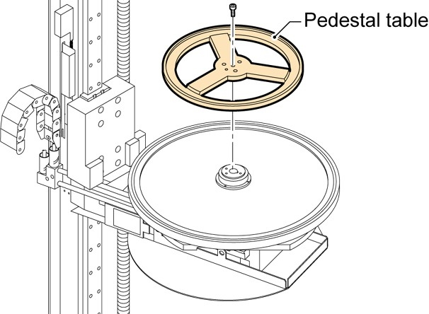
16.1 부착 나사를 제거한 후 받침대 테이블을 제거합니다.
16.2 에탄올/DI 수용액에 적신 클린룸 물티슈를 사용하여 받침대 테이블을 청소합니다.

17. 캡 커버와 열전대 포트 커버가 있는 경우 제거합니다.
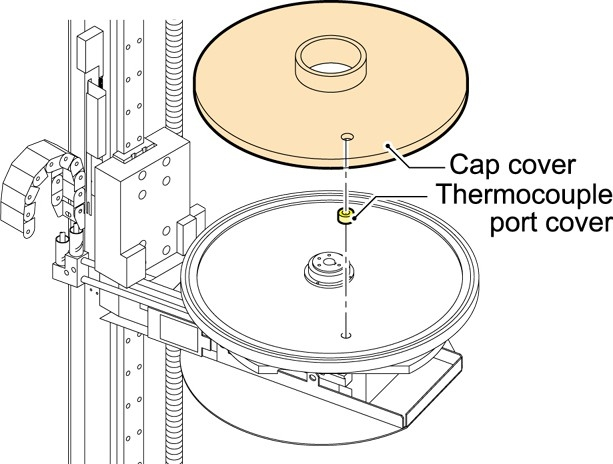

18. 커넥터를 분리합니다.

19. 안전 팔을 제거합니다.
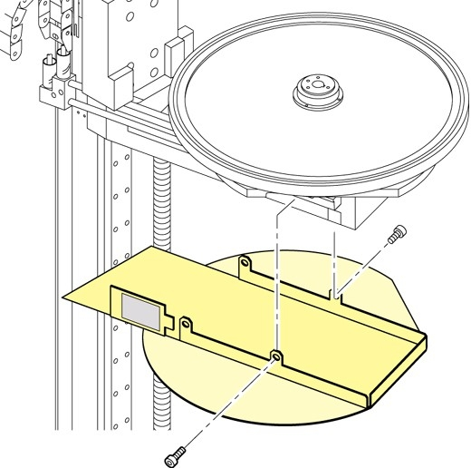

20. 캡을 고정하는 나사(나사 세 개)를 제거합니다.
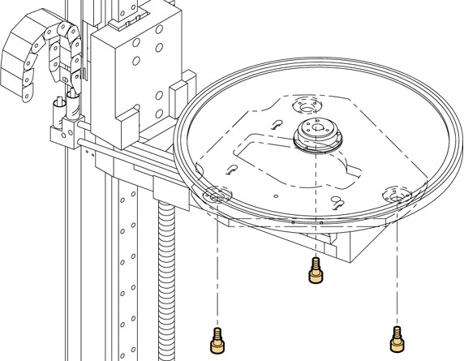

21. 뚜껑 아래에 플라스틱 시트를 놓습니다.

22. 냉각수 파이프를 제거하려면:
참고: 냉각수 파이프가 제거되면 냉각수 파이프 조인트를 클린룸 물티슈로 덮습니다. 누수 가능성이 있습니다. 물이 유출되면 해당 부위를 건조시킨 후 에탄올/DI 수용액으로 세척합니다.
22.1 캡을 약간 들어 올립니다.
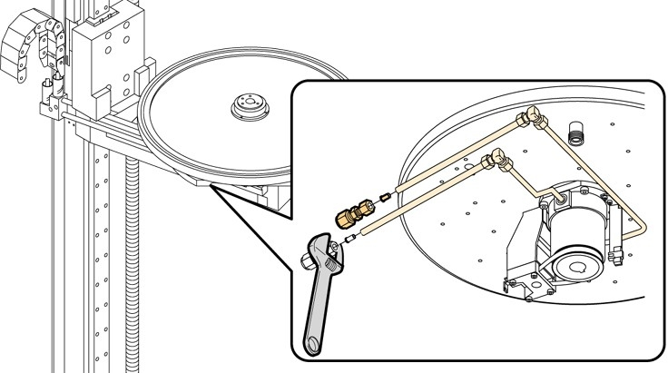
22.2 수냉식 파이프와 질소 가스 라인을 제거합니다.

23. 캡을 제거합니다.
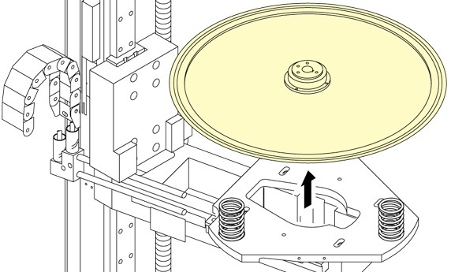

24. 캡 아래에 위치한 자성 유체 씰 유닛, 스페이서 및 O링을 제거합니다.
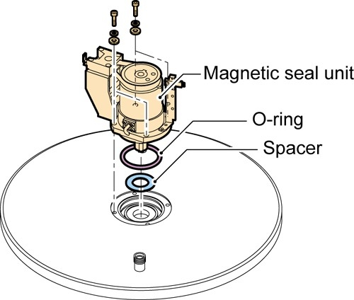

25. 모터, 센서 및 타이밍 벨트를 제거합니다.
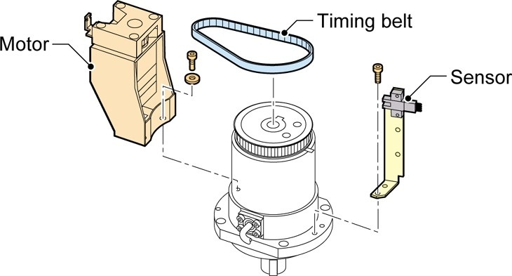

26. 풀리와 열쇠를 제거합니다.
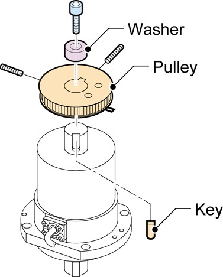

27. 자기 유체 씰 유닛의 수냉식 라인을 제거합니다
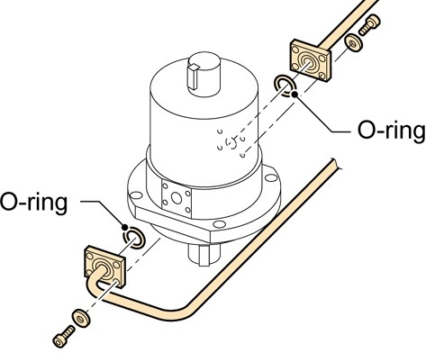

마그네틱 씰 유닛 설치
28. 새 자기 씰 유닛을 준비합니다.

29. 자기 유체 씰 유닛용 수냉식 라인 설치

30. 자기 씰 유닛에 풀리를 설치하려면:
30.1 둥근 모서리가 아래쪽을 향하도록 키를 설치합니다.
30.2 자기 유체 씰 유닛의 샤프트에 풀리를 설치합니다.
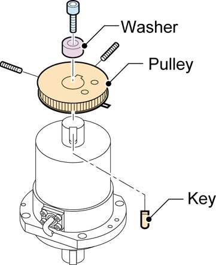
30.3 금속 세척기를 설치합니다.
30.4 풀리를 샤프트에 고정합니다.

31. 자기 씰 유닛과 모터를 조립하려면:
31.1 육각형 나사 세 개로 모터, 센서 및 타이밍 벨트를 임시로 설치합니다.
31.2 타이밍 벨트를 조정하고 육각형 나사를 고정합니다.
31.3 타이밍 벨트 장력을 조정하고 육각형 나사를 조여 고정합니다.
31.4 풀리에 설치된 키커가 센서에 닿지 않는지 확인합니다.
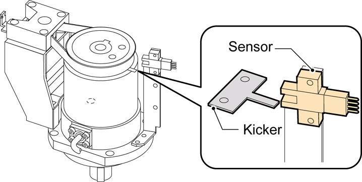

32. 캡 아래에 자성 유체 씰 유닛을 설치하려면:
32.1 IPA/물 용액에 적신 클린룸 물티슈를 사용하여 캡, 스페이서, 새 O링의 아래쪽을 청소합니다.
32.2 캡 아래에 스페이서와 새 O링을 설치합니다.
32.3 캡 아래에 자성 유체 씰 유닛을 설치하고, 네 개의 육각형 나사를 사용하여 고정합니다.
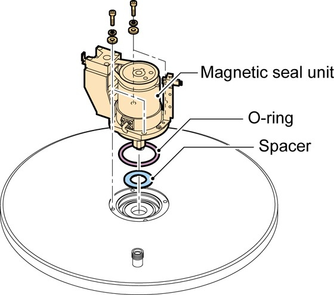
33. 자기 유체 씰 유닛 제거 단계의 역순으로 캡과 받침대 테이블을 설치합니다.

34. 시스템에 나사나 공구가 느슨하게 남아 있지 않은지 확인합니다. 공구와 부품이 느슨하면 전기 합선이 발생할 수 있습니다.

35. 뒷문을 닫습니다.

36. 메인 차단기에서 잠금 장치와 태그아웃 장치를 제거합니다.

37. 시스템을 재시작합니다.

38. HCT를 사용하여 보트 엘리베이터를 튜브 카트 세트 위치로 이동합니다.

39. 뒷문을 엽니다.

40. 보트와 받침대를 설치합니다.

41. 뒷문을 닫습니다.

42. 보트 엘리베이터를 초기화하여 제대로 작동하는지 확인합니다.

43. 가스 박스에 있는 단자에서 HCT 케이블을 분리합니다.

44. 위험 가스 밸브에서 잠금 장치와 태그아웃 장치를 제거합니다.